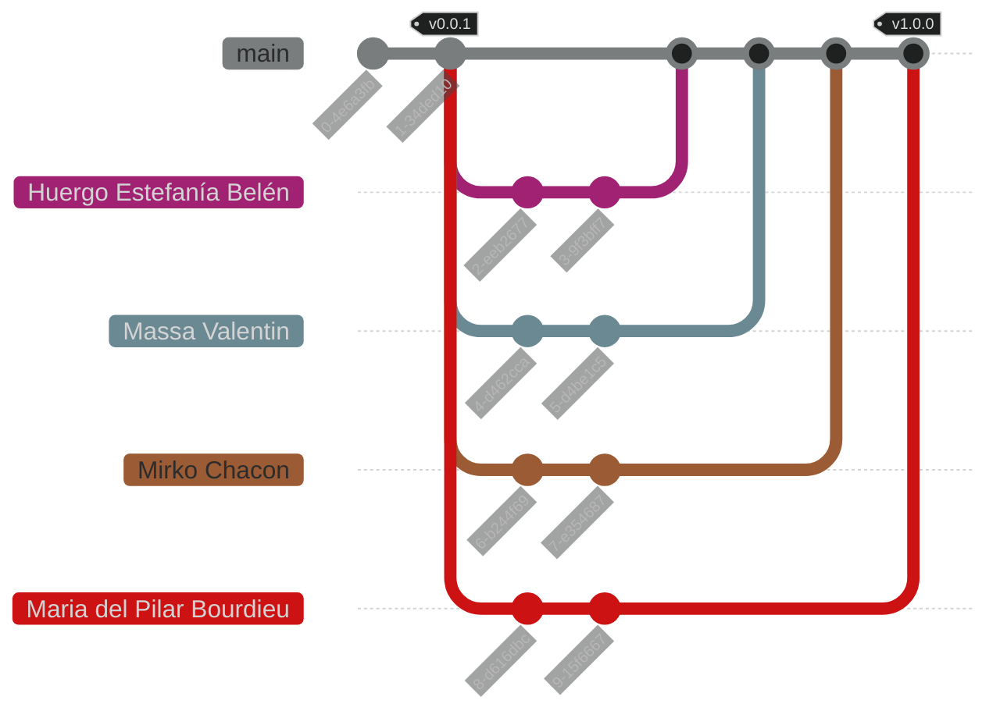

<h1 align="center">
    Trabajo Práctico: Diccionario de Datos [1C 2025]
</h1>

<p align="center">
    <strong>Repositorio del Trabajo Práctico de Algoritmos y Estructuras de Datos</strong>
    <br>
    <strong>- <a href="https://www.unlam.edu.ar/">UNLaM</a> (Universidad Nacional de La Matanza) -</strong>
</p>

<p align="center">
    <a href="#resumen">Resumen</a> •
    <a href="#características">Características</a> •
    <a href="#instalación">Instalación</a> •
    <a href="#problemas-conocidos">Problemas conocidos</a> •
    <a href="#cómo-usar">Cómo usar</a>
    <br>
    <a href="#estructura-del-proyecto">Estructura del proyecto</a> •
    <a href="#flujo-de-trabajo-del-equipo">Flujo de trabajo del equipo</a> •
    <a href="#equipo-de-desarrollo">Equipo de desarrollo</a> •
    <a href="#material-adicional">Material adicional</a>
    <br>
    <a href="#licencia">Licencia</a> •
    <a href="#agradecimientos">Agradecimientos</a>
</p>

---

## Resumen

Este repositorio contiene el Trabajo Práctico de la materia Algoritmos y Estructuras de Datos de la [Universidad Nacional de La Matanza (UNLaM)](https://www.unlam.edu.ar/) correspondiente al primer cuatrimestre de 2025. El proyecto consiste en la implementación de un TDA Diccionario (hashmap) genérico en C y el desarrollo de un procesador de textos que utiliza dicho TDA para analizar archivos y extraer estadísticas sobre palabras y símbolos.

---

## Características

- **TDA Diccionario genérico**: Soporta claves y valores de cualquier tipo y tamaño, con manejo eficiente de colisiones.
- **Primitivas del TDA Diccionario**:
    - `crear_dic`: Inicialización con capacidad máxima.
    - `poner_dic`: Inserción de clave-valor y manejo de colisiones.
    - `obtener_dic`: Búsqueda eficiente por clave.
    - `sacar_dic`: Eliminación de elemento por clave.
    - `recorrer_dic`: Recorrido y ejecución de acción sobre cada elemento.
    - `vaciar_dic`: Liberación total de memoria.
- **Procesador de textos**:
    - Lectura de archivos e ingreso de archivos a procesar por interfaz.
    - Estadísticas: cantidad de palabras, espacios y signos de puntuación.
    - Cuenta de apariciones de cada palabra.
    - Podio con las 5 palabras más frecuentes.
- **Lotes de prueba**: Al menos 4 archivos de prueba que demuestran el funcionamiento y la capacidad del TDA para manejar colisiones.
- **Interfaz de usuario**: Permite seleccionar el archivo y muestra de forma clara los resultados.
- **Arquitectura modular**: Separación de headers (`.h`) y código fuente (`.c`) para cada TDA.
- **Documentación y buenas prácticas de C**.

---

## Instalación

1. **Clona el repositorio** en tu dispositivo.
2. **Compila las dependencias**:
    - Abre el proyecto Procesador de Textos en tu IDE (recomendado: CodeBlocks).
    - Ve a las opciones de build (build options).
    - En "Linker Settings", agrega las siguientes rutas relativas a las librerías:
        - `..\..\lib\TDA_t_diccionario\bin\Debug\libTDA_t_diccionario.a`
        - `..\..\lib\Lista\bin\Debug\libLista.a`
    - Asegúrate de compilar primero las librerías y luego el proyecto principal.
3. **Carga de Archivos**:
    - Los archivos de texto a analizar deben colocarse en la carpeta indicada por la interfaz.
    - Se recomienda anotar el nombre de los archivos para su posterior ingreso.

---

## Problemas conocidos

| Problema | Solución |
| --- | --- |
| Error de linker (falta de librería) | Verifica haber agregado correctamente las rutas relativas de las librerías en Linker Settings. |
| El programa no encuentra el archivo de texto | Asegúrate de colocar el archivo en la carpeta indicada por la interfaz y de ingresar el nombre correctamente. |

---

## Cómo usar

1. **Preparación**: Compila el proyecto y asegúrate de que las rutas de las librerías estén bien configuradas.
2. **Carga de archivo**: Coloca el archivo de texto a analizar en la carpeta indicada.
3. **Ejecución**:
    - Inicia el programa.
    - Selecciona el archivo a procesar mediante la interfaz.
    - El sistema mostrará: cantidad de palabras, espacios, signos de puntuación, podio de palabras más usadas, etc.
4. **Lotes de prueba**: Utiliza los archivos de prueba provistos para verificar el funcionamiento (incluyen casos de colisiones en los hashes).

---

## Estructura del proyecto

```plaintext
Algoritmos_tp_1c2025/
│
├── lib/
│   ├── TDA_t_diccionario/
│   │   ├── t_diccionario.h
│   │   ├── t_diccionario.c
│   │   └── bin/
│   ├── TDA_t_ListaDiccionario/
│   │   ├── ListaDiccionario.c
│   │   ├── ListaDiccionario.h
│   │   └── bin/
│   └── Lista/
│       ├── lista.h
│       ├── lista.c
│       └── bin/
│
├── ProcesadorDeTextos/
│   ├── main.c
│   ├── ...
│
├── tests/
│   ├── lote1.txt
│   ├── lote2.txt
│   ├── lote3.txt
│   ├── lote4.txt
│
├── InstruccionesDeUso
├── Diccionario
├── README.md
├── LICENSE
└── ...
```

- `lib/` — Librerías auxiliares (TDA Diccionario, Lista, etc.).
- `ProcesadorDeTextos/` — Código fuente principal del procesador.
- `tests/` — Lotes de prueba para verificar el correcto funcionamiento.
- `README.md` — Este archivo.

---

## Flujo de trabajo del equipo



- `main`: Rama principal de desarrollo.
- Ramas individuales para cada integrante.

---

## Equipo de desarrollo

- Huergo Estefanía Belén
- Massa Valentin ([ValentinMassa](https://github.com/ValentinMassa))
- Mirko Chacon
- Maria del Pilar Bourdieu

---

## Material adicional

- Documentación interna y comentarios en el código fuente.
- Pruebas y lotes de ejemplo en la carpeta `/tests`.

---

## Licencia

Este repositorio está bajo la [Licencia MIT](./LICENSE). Para más información, visita [choosealicense.com](https://choosealicense.com/licenses/mit/).

---

## Agradecimientos

Agradecemos a los docentes de la [UNLaM](https://www.unlam.edu.ar/) por su acompañamiento y guía durante la cursada.
