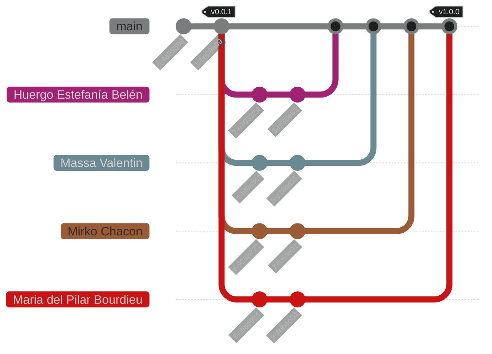

<h1 align="center">
    Trabajo Práctico de Algoritmos [1C 2025]
</h1>

<p align="center">
    <strong>Repositorio del trabajo práctico de la cursada Algoritmos - Primer Cuatrimestre 2025</strong>
    <br>
    <strong>- <a href="https://www.unlam.edu.ar/">UNLaM</a> (Universidad Nacional de La Matanza) -</strong>
</p>

<p align="center">
    <a href="#resumen">Resumen</a> •
    <a href="#características">Características</a> •
    <a href="#instalación">Instalación</a> •
    <a href="#problemas-conocidos">Problemas conocidos</a> •
    <a href="#cómo-jugar">Cómo jugar</a>
    <br>
    <a href="#estructura-de-la-aplicación">Estructura de la aplicación</a> •
    <a href="#flujo-de-trabajo-del-equipo">Flujo de trabajo del equipo</a> •
    <a href="#equipo-de-desarrollo">Equipo de desarrollo</a> •
    <a href="#material-adicional">Material adicional</a>
    <br>
    <a href="#licencia">Licencia</a> •
    <a href="#agradecimientos">Agradecimientos</a>
</p>

## Resumen

Este repositorio contiene el trabajo práctico de la materia Algoritmos y Estructuras de Datos de la [Universidad Nacional de La Matanza (UNLaM)](https://www.unlam.edu.ar/) correspondiente al primer cuatrimestre de 2025. El proyecto está desarrollado íntegramente en lenguaje C y abarca conceptos fundamentales de algoritmos, estructuras de datos y buenas prácticas de desarrollo.

## Características

- Arquitectura modular y planificación del proyecto.
- Implementación de estructuras dinámicas (listas, etc.).
- Control de entradas y validaciones.
- Uso de memoria dinámica.
- Convenciones y estándares de código.
- Documentación del código usando [Doxygen](https://www.doxygen.nl/).
- Flujo de trabajo en equipo (ramas, etiquetas y releases).
- Integración continua con [GitHub Actions](https://docs.github.com/es/actions).
- Despliegue de entregables.
- Ejercitación de commits siguiendo [Conventional Commits](https://www.conventionalcommits.org/es/v1.0.0/).
- Local storage de registros relevantes al TP.
- (Completar/editar según los requerimientos específicos del TP.)

## Instalación

1. Clonar el repositorio en tu dispositivo.
2. Instalar el IDE [CodeBlocks](https://www.codeblocks.org/) con MinGW (o tu entorno de C preferido).
3. Abrir los archivos de proyecto (por ejemplo, `src.cbp` para el proyecto principal y `libs.cbp` para las librerías si corresponde).
4. Compilar primero las librerías y luego el proyecto principal en modo Release o Debug.
5. Ejecutar el trabajo práctico desde el entorno o línea de comandos.

### Problemas conocidos

| Problema | Solución |
| --- | --- |
| El proyecto principal no compila | Asegúrate de compilar primero todas las dependencias o librerías necesarias. Verifica que las rutas de los archivos sean correctas y que el entorno esté correctamente configurado. |
| Faltan archivos de configuración | Verifica que todos los archivos requeridos estén presentes en las carpetas correspondientes (`src/configuration`, `src/statics`, etc.). |

## Cómo  ejecutar

1. Iniciar el programa principal.
2. Seguir las instrucciones en pantalla para interactuar con el sistema (por ejemplo, menú principal, carga de datos, ejecución de algoritmos, etc.).
3. Consultar la documentación interna o los comentarios en el código para detalles sobre el uso de cada módulo. --> Recomendado el .docx InstruccionesDeUso.docx


## Estructura de la aplicación

```plaintext
Algoritmos_tp_1c2025/
│
├── .github/
│   └── workflows/
│
├── docs/
│
├── libs/
│
├── src/
│   ├── configuration/
│   ├── play/
│   ├── player/
│   ├── show-ranking/
│   ├── statics/
│   └── main.c
│
├── .clang-format
├── .gitignore
├── LICENSE
└── README.md
```

- `.github/` — Integración continua.
- `docs/` — Documentación adicional.
- `libs/` — Librerías auxiliares del proyecto (si aplica).
- `src/` — Código fuente principal y submódulos.
- `.clang-format` — Formato de código.
- `.gitignore` — Archivos ignorados por Git.
- `LICENSE` — Licencia del proyecto.
- `README.md` — Este archivo.

## Flujo de trabajo del equipo



- `main`: Rama principal de desarrollo.
- Otras ramas: Desarrollo individual por cada integrante, fusionadas vía pull requests.

> Las versiones estables solo estarán disponibles como releases.

## Equipo de desarrollo

- Huergo Estefanía Belén
- Massa Valentin ([ValentinMassa](https://github.com/ValentinMassa))
- Mirko Chacon
- Maria del Pilar Bourdieu

## Material adicional

- Documentación interna en la carpeta `/docs`.
- Comentarios y Doxygen en el código fuente.

## Licencia

Este repositorio está bajo la [Licencia MIT](./LICENSE). Para más información, visita [choosealicense.com](https://choosealicense.com/licenses/mit/).

## Agradecimientos

Agradecemos a los docentes de la [UNLaM](https://www.unlam.edu.ar/) por su apoyo y guía durante la cursada.
